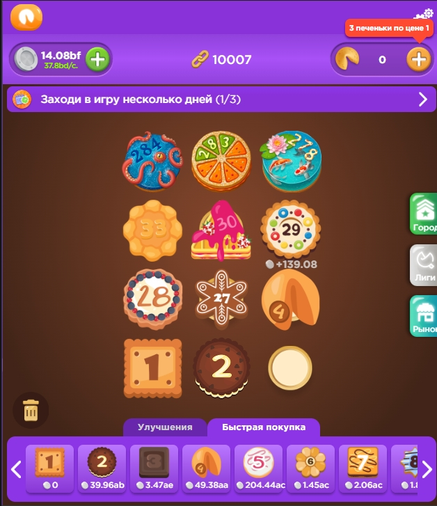
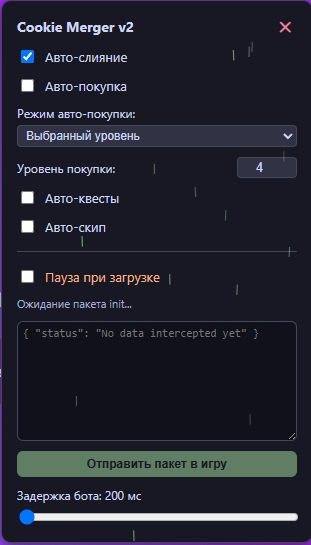
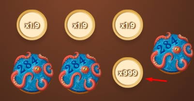
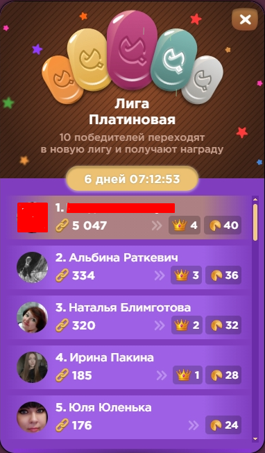

# Web App Client-Side Interception & Automation Engine (PoC)

A professional Proof-of-Concept (PoC) demonstrating structural architectural vulnerabilities in web applications (specifically focusing on **CWE-20: Improper Input Validation** and lack of server-side state verification).

This project showcases how client-side state manipulation (via API interception) combined with UI automation can fully bypass weak business logic when the back-end completely trusts data sent from the client.

---

## 🛑 DISCLAIMER / ОТКАЗ ОТ ОТВЕТСТВЕННОСТИ

* **EN:** This repository and the code contained herein are published strictly for educational, academic, and defensive security research purposes. The author **BEARS NO LIABILITY** for any misuse, damage, account bans, or violations of Terms of Service (ToS) caused by this software. Use it entirely at your own risk.
* **RU:** Данный репозиторий и весь содержащийся в нём код опубликованы исключительно в ознакомительных, образовательных и научно-исследовательских целях (безопасность веб-приложений). Автор **НЕ НЕСЕТ НИКАКОЙ ОТВЕТСТВЕННОСТИ** за любое нецелевое использование данного софта, возможные баны аккаунтов, убытки или нарушения лицензионных соглашений сторонних платформ. Всё использование кода осуществляется пользователями на их собственный страх и риск.

---

## 🛠️ Key Architectural Features

* **API Interception Layer**: Monkey-patches communication methods to isolate, block, and hot-patch JSON responses dynamically before they hit the application state.
* **React Event Injection**: Simulates high-fidelity user interactions (Drag-and-Drop, Touch, and Pointer events) by traversing the internal React UI fiber tree.
* **Dynamic Local State Modification**: Hard-coded structural validation bypass (simulating zero-cost client operations).
* **Built-in UI Panel**: Lightweight, vanilla JS floating control panel with dynamic state management via `localStorage`.

---

## 📊 Visual Proof of Concept (Screenshots)

### 1. In-Game Automation & State Overriding
Demonstration of the target interface where elements are manipulated. The engine monitors and automatically handles internal structural components on the web canvas.

### 2. Client-Side API Interception UI
The injected embedded panel (`Cookie Merger v2`) functioning inside the browser environment. It enables or disables real-time client-side hot-patching, automated merging, buying loops, and displays intercepted JSON objects directly in the text area.

### 3. Structural Matrix Exploitation (Plate Values)
Visual representation of successful structural local variable patching. The field validation is overridden, demonstrating how client-side state mutations can force arbitrary values (e.g., multiplier grids or structural IDs forced to `9999`).

### 4. Leaderboard Consistency (Client-to-Server Trust)
An example of leaderboard behavior under unvalidated state submission. The client-side calculated value is accepted by the platform's core architecture due to missing server-side cryptographic signatures or multi-step transaction logs.

---

## 📂 Repository Structure

* `engine.user.js` — The core Tampermonkey/Violentmonkey script containing the interception and UI automation logic.
* `README.md` — Project documentation and research notes.
* `LICENSE` — Open-source MIT License.

## 🚀 How It Works (Technical Overview)

1. **The Hook**: The engine overrides the global communication channels to look for specific API endpoints (e.g., `/api/v1/init`).
2. **The Patch**: Once intercepted, the incoming JSON object is structural-mapped. Values, prices, and grid arrays are mutated locally before execution.
3. **The Simulation**: The UI layer continuously scans the DOM container, pairs identical entity classes based on strict type match, and fires synthetically generated sequence events (`touchstart` -> `pointerdown` -> `touchmove` -> `pointerup` -> `click`).

---

## 🛠️ Installation & Execution

To run this Proof-of-Concept engine in your local browser environment for testing purposes, follow these steps:

1. **Install a Userscript Manager**: Download and install a verified browser extension such as [Tampermonkey](https://www.tampermonkey.net/) or [Violentmonkey](https://violentmonkey.github.io/).
2. **Add the Script**: 
   * Click on the extension icon in your browser and select **Create a new script**.
   * Copy the entire source code from the `engine.user.js` file in this repository.
   * Paste it into the editor and save (`Ctrl + S`).
3. **Launch the Web Application**: Open the target application URL in your browser.
4. **Initialize the Control Panel**: 
   * Once the application loads, the embedded panel should automatically render on the right side of the screen.
   * Alternatively, press the **`F2`** key or the tilde key (**`` ` ``**) on your keyboard to toggle the panel's visibility.
